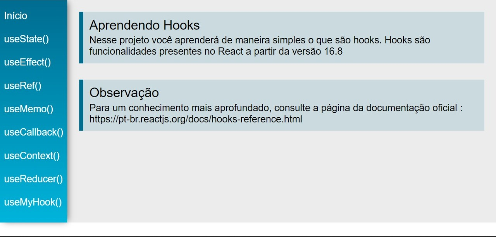

# Aprenda React 📝

Projeto simples que explica o funcionamento dos hooks mais utilizados em React e sobre como criar o seu próprio hook.

# A aplicação está on-line no link: 

```
https://aprenda-react.vercel.app/
```

## Mas recomendo que você analise o projeto em sua maquina, siga este passo a passo: 😁

<br>

### Clone o repositório😎

```
https://github.com/jovimoura/aprenda-react
```

### Acesse o diretorio🤓

```
cd <nome-da-pasta>
```
### Instale as dependências🤠
```
npm install
```
### Inicie a aplicação🤩
```
npm run serve
```
### A aplicação, por padrão, fica na porta:🤗

```
http://localhost:3000/
```

## Imagem do projeto 💻



## Tecnologias utilizadas🦉

<ul>
    <li>React JS</li>
    <li>JavaScript</li>
    <li>HTML</li>
    <li>CSS</li>
</ul>

## Autor😃

### João Victor dos Santos Moura
### E-mail: joaovictors.mouraa@gmail.com
### Linkedin: https://www.linkedin.com/in/jovimoura10/
